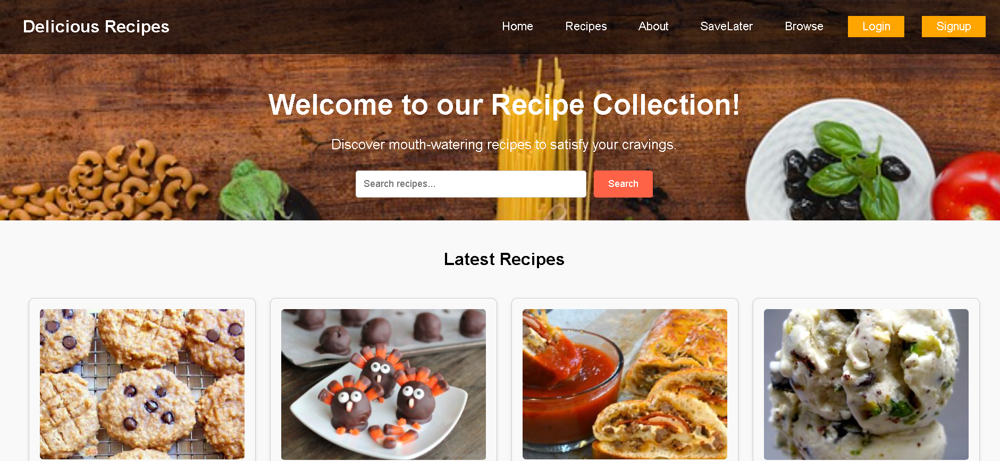
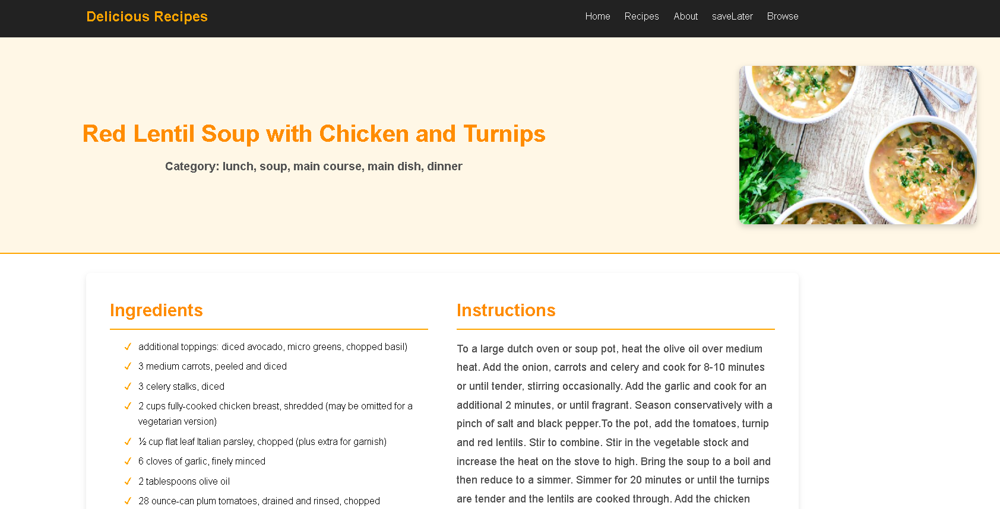
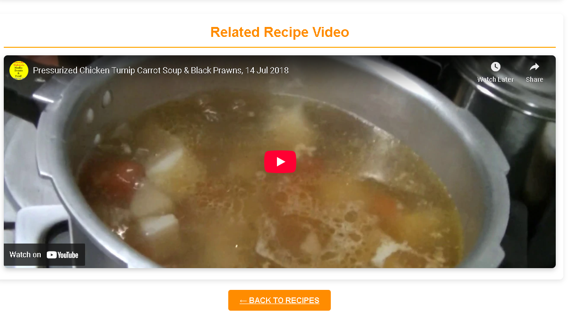

# Recipe App

A full-stack Recipe application that allows users to browse, search, and view detailed recipes. The app features a modern interface, recipe-related videos, and user-friendly navigation.

## Table of Contents

- [Interface](#interface)
- [Features](#features)
- [Tech Stack](#tech-stack)
- [Getting Started](#getting-started)
- [Project Structure](#project-structure)
- [Routers](#routers)
- [Contributing](#contributing)
- [License](#license)

## Interface

Below are screenshots of the application interface:

### Home Page



### Recipe Details



### Recipe Related Video



## Features

- Browse a wide variety of recipes
- Search recipes by name or ingredient
- View detailed recipe instructions and ingredients
- Watch recipe-related videos
- Responsive and intuitive user interface

## Tech Stack

- **Frontend:** HTML, CSS, JavaScript (or React/Vue/Angular if applicable)
- **Backend:** Node.js, Express
- **Database:** MongoDB (or your choice)
- **Other:** REST API, JWT Authentication (if implemented)

## Getting Started

### Prerequisites

- Node.js and npm installed
- MongoDB installed and running

### Installation

1. Clone the repository:

   ```sh
   [https://github.com/IsSurajKadam/recipe-app-javascript.git]
    cd recipe-app-javascript
   ```

2. Install backend dependencies:

   ```sh
   cd backend
   npm install
   ```

3. Set up environment variables:

   - Create a `.env` file in the `backend` directory and add your configuration.

4. Start the backend server:

   ```sh
   npm start
   ```

5. Open the frontend:
   - Open `frontend/index.html` in your browser or run your frontend framework's dev server.

## Project Structure

```
Recipe/
├── backend/
│   ├── controllers/
│   ├── models/
│   ├── routes/
│   └── ...
├── frontend/
│   ├── css/
│   ├── js/
│   └── ...
├── Interface/
│   ├── Home.png
│   ├── Recipe_related_video.png
│   └── Recipedetails1.png
└── README.md
```

## Routers

### 1. Get All Recipes

**Endpoint:** `GET /api/recipes`

**Response Example:**

```json
[
  {
    "id": "1",
    "title": "Spaghetti Carbonara",
    "ingredients": ["spaghetti", "eggs", "cheese", "bacon"],
    "instructions": "Boil pasta. Cook bacon. Mix with eggs and cheese.",
    "image": "carbonara.jpg"
  },
  ...
]
```

---

### 2. Get Recipe by ID

**Endpoint:** `GET /api/recipes/:id`

**Response Example:**

```json
{
  "id": "1",
  "title": "Spaghetti Carbonara",
  "ingredients": ["spaghetti", "eggs", "cheese", "bacon"],
  "instructions": "Boil pasta. Cook bacon. Mix with eggs and cheese.",
  "image": "carbonara.jpg",
  "video": "https://youtube.com/..."
}
```

---

### 3. Search Recipes

**Endpoint:** `GET /api/recipes/search?q=carbonara`

**Response Example:**

```json
[
  {
    "id": "1",
    "title": "Spaghetti Carbonara",
    "ingredients": ["spaghetti", "eggs", "cheese", "bacon"],
    "instructions": "Boil pasta. Cook bacon. Mix with eggs and cheese.",
    "image": "carbonara.jpg"
  }
]
```

---

### 4. Add a New Recipe

**Endpoint:** `POST /api/recipes`

**Request Body Example:**

```json
{
  "title": "Pancakes",
  "ingredients": ["flour", "milk", "eggs", "sugar"],
  "instructions": "Mix ingredients. Cook on skillet.",
  "image": "pancakes.jpg"
}
```

**Response Example:**

```json
{
  "message": "Recipe created successfully",
  "recipeId": "2"
}
```

---

### 5. Delete a Recipe

**Endpoint:** `DELETE /api/recipes/:id`

**Response Example:**

```json
{
  "message": "Recipe deleted successfully"
}
```

## Contributing

Contributions are welcome! Please open issues or submit pull requests for improvements.

## License

This project is licensed under the MIT License.
